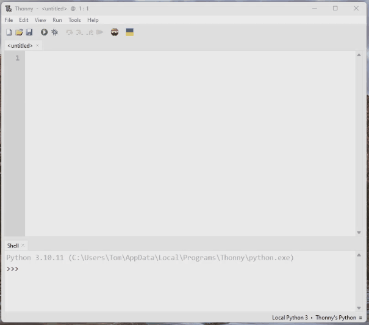
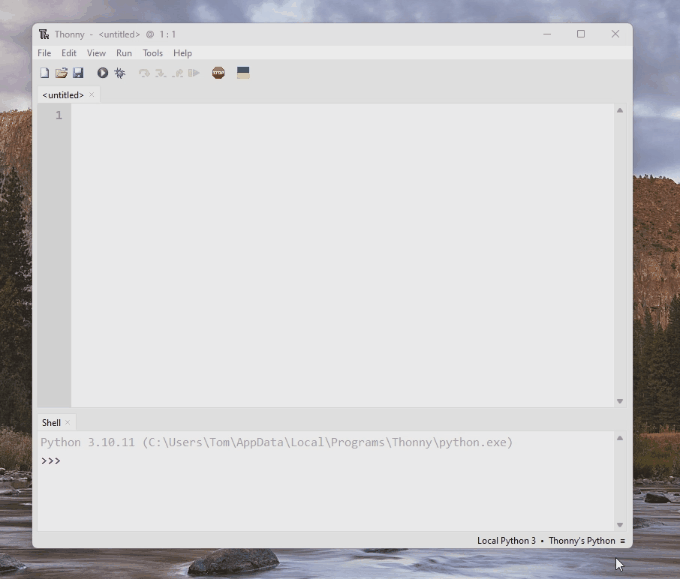

# Music Thing Modular Computer MicroPython Examples
These examples show some basic uses of the Music Thing Modular Computer module using the micropython language.

## Setup
Instructions for connecting a computer to a computer can be confusing so 'Computer module' is used to indicate the Music Thing Computer and 'computer' (lower case) is used to describe your PC or Mac etc.

- Remove the large knob from the Computer module to access the boot select button
- Connect a USB cable from the module to your computer
- Insert a card into the card slot (the contents will be overwritten)
- Hold the boot select button and reset button on the Computer module
- Release the reset button and then the boot select button (the Computer module should show as a drive on your computer)
- Download and install Thonny from https://thonny.org/
- Open Thonny and click on 'Thonny's Python' in the bottom right corner
    - Click on 'Install MicroPython'
    - Make sure Taget volume shows 'RPI-RP2' and MicroPython family shows 'RP2'
    - Select 'Raspberry Pi Pico / Pico H' from the variant list
    - Click Install and when it has completed, click Close

    

- Click on 'Thonny's Python' again and select 'MicroPython (RP2040)'

    

- Select File -> Open and 'This computer', then open one of the example .py files
- Click on the Play button to start it running on the Computer module

If you make changes to the code in Thonny, you just need to press the Play button again to send the updated version to the module.

After completing these steps you won't need to do it again. If you turn your system off and on again, it will be ready to send receive code from Thonny as long as the MicroPython firmware is on the program card.

## Running code without Thonny
You can have your code run on the Computer module automatically without having to have a computer connected with the following steps:
- Make sure you have Thonny open and your code in the active tab with the USB cable connected to the Computer module
- Press the Stop button if the code is running
- Select File -> Save As and click on 'RP2040 device'
- Name your file main.py and click OK

You can now remove the USB cable and press the reset button the Computer module to start your code. You can still use Thonny to write other pieces of code but any script saved to the module as main.py will be run when it starts up.